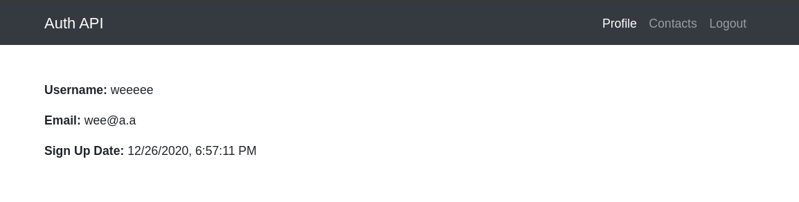

# jwt_auth_MERN

## React App that persists users in the browser with JWT tokens

## Quick Install and Run
- In both frontend and backend directories, install dev dependencies with <code>npm i</code> 
- In both frontend and backend directories, run with <code>npm start</code> 

